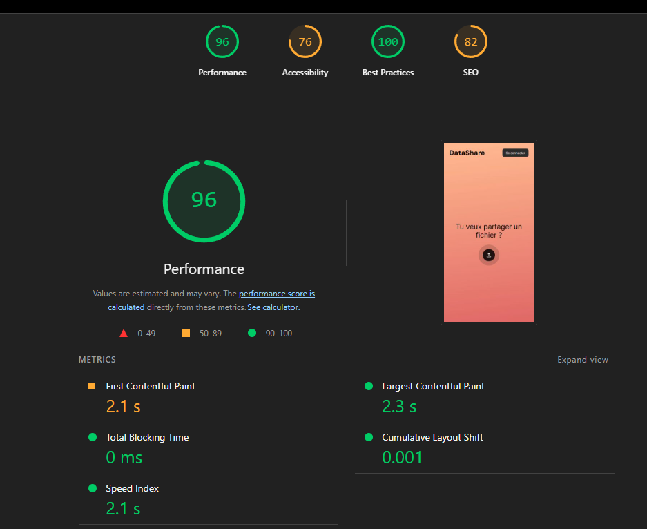

# Rapport de Performance - DataShare

Ce document présente les résultats des tests de charge sur l'API et le budget de performance défini pour le frontend.

---

## 0. Budget Performance

Objectifs cibles à respecter en production :

| Indicateur | Cible |
| :--- | :--- |
| **Temps de réponse API (p95)** | < 200 ms |
| **Upload d'un fichier de 10 MB** | < 3 s |
| **Time to Interactive (TTI) — frontend** | < 2 s |

Ces seuils servent de référence pour valider chaque mise en production et orienter les décisions d'optimisation.

---

## 1. Performance Backend (API)

**Objectif :** Valider la stabilité de l'upload de fichiers sous charge concurrente.

### Méthodologie
*   **Outil :** [k6](https://k6.io/)
*   **Environnement :** Local (Docker)
*   **Scénario :** 20 utilisateurs virtuels (VUs) uploadant simultanément des fichiers pendant 30 secondes.
*   **Script :** `perf/k6-upload-test.js` (Auth JWT + POST /api/Files)

### Résultats du Test de Charge

> **Date du test :** 17 Février 2026
> **Commande :** `k6 run perf/k6-upload-test.js`

| Métrique | Valeur Obtenue | Objectif | Statut |
| :--- | :--- | :--- | :--- |
| **Itérations Totales** | 500 uploads | > 100 | ✅ Succès |
| **Requêtes / seconde** | ~32 /s | > 10/s | ✅ Succès |
| **Temps Moyen (Avg)** | 107.9 ms | < 500 ms | ✅ Excellent |
| **P95 (95% des cas)** | 125.19 ms | < 2000 ms | ✅ Excellent |
| **Taux d'Erreur** | 0.00% | < 1% | ✅ Parfait |
| **Données Transférées** | 52 MB | - | Info |

### Analyse
Le serveur encaisse parfaitement la charge sans dégradation notable. Le temps de réponse moyen de ~100ms pour un upload complet (y compris l'écriture disque) démontre une excellente gestion des I/O asynchrones par .NET 8.

---

## 2. Budget de Performance Frontend (Vue.js)

Afin de garantir une expérience utilisateur fluide, les limites suivantes ont été définies pour l'application client.

### Métriques Cibles (Lighthouse / Network)

| Métrique | Budget Cible | Justification |
| :--- | :--- | :--- |
| **Bundle Size (Gzipped)** | < 350 KB | Chargement rapide sur réseau mobile (3G/4G). |
| **FCP (First Contentful Paint)** | < 1.5 s | Affichage rapide des éléments visuels. |
| **LCP (Largest Contentful Paint)** | < 2.5 s | Temps pour voir le contenu principal. |
| **CLS (Layout Shift)** | < 0.1 | Stabilité visuelle (pas d'éléments qui sautent). |

### Optimisations mises en place
*   Utilisation de **Vite** pour un bundling optimisé (Tree-shaking).
*   Chargement asynchrone des composants (Lazy Loading sur les routes Vue Router).
*   Assets CSS minifiés automatiquement en production.

---

## 3. Métriques Frontend (Lighthouse)

### Comment mesurer

1. Lancer l'application en mode production (`npm run build` puis `npm run preview`).
2. Ouvrir Chrome DevTools → onglet **Lighthouse**.
3. Sélectionner : **Performance**, **Accessibility**, **Best Practices**, **SEO** → « Analyze page load ».
4. Ou via CLI : `npx lighthouse http://localhost:4173 --output=html --output-path=./lighthouse-report.html`

### Scores cibles

| Catégorie | Score cible |
| :--- | :--- |
| **Performance** | ≥ 90 |
| **Accessibility** | ≥ 90 |
| **Best Practices** | ≥ 90 |
| **SEO** | ≥ 80 |

### Résultats Lighthouse (audit du 31/03/2026)

| Catégorie | Score | Objectif | Statut |
|-----------|-------|----------|--------|
| **Performance** | 96 | ≥ 90 | ✅ |
| **Accessibility** | 76 | ≥ 90 | ⚠️ En dessous de l'objectif |
| **Best Practices** | 100 | ≥ 90 | ✅ |
| **SEO** | 82 | ≥ 80 | ✅ |

**Métriques détaillées :**

| Métrique | Valeur | Budget |
|----------|--------|--------|
| FCP (First Contentful Paint) | 2.1 s | < 1.5 s ⚠️ |
| LCP (Largest Contentful Paint) | 2.3 s | < 2.5 s ✅ |
| Total Blocking Time | 0 ms | < 200 ms ✅ |
| CLS (Cumulative Layout Shift) | 0.001 | < 0.1 ✅ |
| Speed Index | 2.1 s | — |

**Analyse :**
- Le score Accessibility (76) est en dessous de l'objectif de 90. Les améliorations prioritaires concernent les contrastes de couleurs et les attributs ARIA manquants.
- Le FCP (2.1s) dépasse légèrement le budget de 1.5s — optimisable via le préchargement des fonts et la réduction du CSS bloquant.
- Le score Performance (96) et Best Practices (100) sont excellents.

---

## 4. Métriques Backend (temps de réponse par endpoint)

Les temps de réponse moyens observés proviennent des logs applicatifs et des tests k6 décrits en section 1.

| Endpoint | Méthode | Temps moyen | P95 | Source |
| :--- | :--- | :--- | :--- | :--- |
| `POST /api/Files` (upload) | POST | ~107 ms | ~125 ms | Test k6 (17/02/2026) |
| `GET /api/files/me` | GET | À mesurer | À mesurer | Logs / k6 |
| `POST /api/auth/login` | POST | À mesurer | À mesurer | Logs / k6 |

> Compléter ce tableau en ajoutant un scénario k6 ciblant les endpoints GET, ou en consultant les logs structurés du serveur .NET (`app.UseSerilogRequestLogging()` ou middleware de timing).

---

## 6. Axes d'Amélioration

Pistes d'optimisation non encore implémentées, classées par impact estimé :

*   **Cache Redis** — Mettre en cache les réponses fréquentes (ex. `GET /api/files/me`) pour réduire la charge sur la base de données. TTL de 30 à 60 secondes selon la fraîcheur requise.
*   **Compression gzip / Brotli** — Activer la compression des réponses HTTP côté serveur .NET (`app.UseResponseCompression()`) pour réduire le poids des réponses JSON et des assets.
*   **CDN** — Servir les fichiers statiques frontend (JS/CSS/images) et les fichiers uploadés via un CDN (ex. Cloudflare, Azure CDN) afin de réduire la latence réseau pour les utilisateurs distants.
*   **Pagination côté serveur** — Si la liste de fichiers (`/api/files/me`) venait à croître, implémenter une pagination curseur ou offset côté API plutôt que de filtrer côté client.
*   **Index base de données** — Vérifier la présence d'index sur les colonnes fréquemment filtrées (ex. `UserId`, `CreatedAt`) dans la table des fichiers.
*   **Optimisation des images** — Générer des miniatures et servir des formats modernes (WebP/AVIF) pour les previews de fichiers image.
