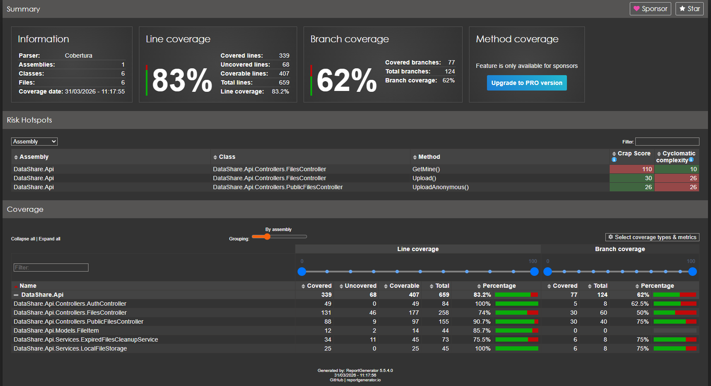

# Tests — DataShare

Stratégie de test, plan de tests, exécution et résultats de couverture du prototype DataShare (API ASP.NET Core 9 + front Vue 3).

---

## 1. Stratégie

Pyramide de tests classique, adaptée à un MVP de 4 semaines : une base de **tests d'intégration HTTP** sur l'API (là où sont les règles métier et de sécurité), des **tests unitaires** sur le service de purge, et des **tests end-to-end Cypress** sur les parcours critiques du front.

| Niveau | Cible | Outils | Où |
|---|---|---|---|
| Unitaire | `ExpiredFilesCleanupService` (purge disque + base, tolérance aux erreurs de stockage) | xUnit, Moq, EF Core InMemory | `backend/DataShare.Api.Tests/UnitTests` |
| Intégration | Tous les endpoints (`/auth`, `/files`, `/public/files`) via `WebApplicationFactory` : base InMemory, stockage réel `LocalFileStorage` dans `Storage/Uploads` (dossier ignoré par Git), schéma d'authentification de test | xUnit, FluentAssertions, `Microsoft.AspNetCore.Mvc.Testing` | `backend/DataShare.Api.Tests/IntegrationTests` |
| End-to-end | Parcours utilisateur réels dans le navigateur contre la stack Docker | Cypress | `frontend/cypress/e2e` |
| Statique | Compilation C# (`Nullable` activé), `vue-tsc` (type-check strict), ESLint (0 erreur) | build | `dotnet build`, `npm run build`, `npm run lint` |

**Isolation des tests d'intégration** : `CustomWebApplicationFactory` remplace PostgreSQL par une base InMemory et la validation JWT par `TestAuthHandler`, qui accepte un en-tête `X-Test-UserId` pour incarner un second utilisateur (tests d'isolation entre comptes). Le stockage passe par le vrai `LocalFileStorage` (ce qui le couvre à 100 %), dans un dossier ignoré par Git. Le service de purge est testé unitairement avec un mock Moq de `IFileStorage` (un `FakeFileStorage` en mémoire est aussi disponible dans `Helpers/`).

---

## 2. Plan de tests

| Fonctionnalité critique | US | Type | Scénario | Critère d'acceptation | Test |
|---|---|---|---|---|---|
| Inscription | US03 | Intégration | Email + mot de passe valides | `200` + JWT non vide | `AuthApiTests` |
| Inscription | US03 | Intégration | Email déjà utilisé / mot de passe < 8 | `400` + liste d'erreurs Identity (`Duplicate…`, `PasswordTooShort`) | `AuthApiTests` |
| Connexion | US04 | Intégration | Identifiants valides | `200` + JWT | `AuthApiTests`, `PrivateFilesControllerTests` |
| Connexion | US04 | Intégration | Mauvais mot de passe / email inconnu | `401` identique dans les deux cas | `AuthApiTests` |
| Upload authentifié | US01 | Intégration | Fichier valide | `201`, métadonnées + token de partage | `FileDetailTests`, `UserFilesTests` |
| Upload authentifié | US01 | Intégration | Fichier absent, `.exe`, durée > 7 j, mot de passe < 6 | `400` + message explicite | `FilesControllerEdgeCasesTests`, `FilesEdgeCasesTests` |
| Historique | US05 | Intégration | `GET /files` et `GET /files/me` (+ filtre `status`) | Uniquement les fichiers de l'utilisateur, tri décroissant | `UserFilesTests`, `SecurityTests` |
| Suppression | US06 | Intégration | Supprimer son fichier / un id inconnu | `204` puis `GET /files/{id}` → `404` / `404` | `FileDetailTests`, `FilesEdgeCasesTests`, `PrivateFilesControllerTests` |
| Lien public | US02 | Intégration | Métadonnées puis téléchargement | `200`, `Content-Disposition: attachment`, contenu identique | `PublicFilesControllerTests`, `PublicFileTests` |
| Lien public | US02 | Intégration | Token inconnu / lien expiré | `404` / `410` (métadonnées **et** téléchargement) | `PublicFilesControllerTests`, `SecurityTests` |
| Upload anonyme | US07 | Intégration | Sans compte / avec compte | `201` / `403` | `PublicFilesControllerTests` |
| Mot de passe fichier | US09 | Intégration | Sans mdp, mauvais mdp, bon mdp | `401`, `401`, `200` | `PublicFilesControllerTests` |
| Expiration | US10 | Unitaire | Fichiers expirés + valides en base | Expirés supprimés (disque + base), valides conservés ; erreur de stockage loguée sans crash | `ExpiredFilesCleanupServiceTests` |
| **Isolation entre utilisateurs** | Sécu | Intégration | L'utilisateur B lit / supprime le fichier de A | `404`, fichier intact pour A | `SecurityTests` |
| **Endpoints privés sans token** | Sécu | Intégration | `GET /files/me`, `GET`/`DELETE /files/{id}` | `401` | `SecurityTests` |
| **Fuite d'information** | Sécu | Intégration | Métadonnées publiques d'un lien | Ni `ownerId`, ni `token`, ni `storedFileName` | `SecurityTests` |
| Parcours complet | US01→06 | E2E | Inscription → connexion → upload → lien → téléchargement par un tiers → suppression | Contenu téléchargé identique, lien invalide après suppression | `full-scenario.cy.ts`, `file-lifecycle.cy.ts` |
| Tags | US08 | E2E | Ajout d'un tag à l'upload, retrouvé dans « Mon espace » | Chip visible sur la ligne du fichier | `tags.cy.ts` |
| Mot de passe fichier | US09 | E2E | Téléchargement sans / avec mot de passe | `401` puis `200` | `password-protection.cy.ts` |
| Limites | Sécu | E2E | Fichier vide, 5 Mo, > 1 Go simulé | Pas de `500`, message d'erreur ou refus | `limits.cy.ts` |

---

## 3. Exécution

### Prérequis

- .NET SDK **9.0**
- Node.js 20+ (Cypress télécharge son binaire à l'installation)
- Docker Desktop (pour les tests E2E, qui visent la stack complète sur http://localhost)

### Backend — tests unitaires + intégration

```bash
cd backend
dotnet test
```

Avec couverture (Coverlet, migrations EF exclues via `coverlet.runsettings`) et rapport HTML :

```bash
cd backend
dotnet test --collect:"XPlat Code Coverage" --settings DataShare.Api.Tests/coverlet.runsettings --results-directory ./TestResults
dotnet tool install -g dotnet-reportgenerator-globaltool   # une seule fois
reportgenerator -reports:"TestResults/**/coverage.cobertura.xml" -targetdir:"TestResults/CoverageReport" -reporttypes:"Html;TextSummary"
# Résumé : TestResults/CoverageReport/Summary.txt — rapport : TestResults/CoverageReport/index.html
```

> Sous Windows, le script `scripts/verify.ps1` enchaîne tests + couverture + build front + audits et affiche un résumé.

### Frontend — type-check, lint, build

```bash
cd frontend/datashare-front
npm ci
npm run build   # vue-tsc + vite build
npm run lint    # ESLint (0 erreur attendue)
```

### End-to-end (Cypress)

```bash
docker compose up -d --build          # stack complète sur http://localhost
cd frontend
npm ci
npx cypress run                       # headless
npx cypress open                      # interface graphique
# autre cible : CYPRESS_BASE_URL=http://localhost:5173 npx cypress run
```

---

## 4. Résultats

### Backend — tests

| Indicateur | Valeur |
|---|---|
| Tests xUnit | **41** (2 unitaires, 39 d'intégration) |
| Dernier run complet documenté | 02/08/2026 : 32 / 32 verts |
| Ajouts du 13/09/2026 (à relancer avant la soutenance : `dotnet test` ou `scripts/verify.ps1`) | 9 tests : isolation entre utilisateurs, `GET /files/me` + filtre `status`, endpoints privés sans token, lien expiré → 410, fuite d'information, inscription (mot de passe court, email dupliqué), connexion email inconnu |

### Backend — couverture (hors migrations EF Core)

Mesure de référence du 02/08/2026 (`coverage.cobertura.xml`, 339 / 407 lignes) :

| Périmètre | Lignes | Branches |
|---|---|---|
| **Global code métier** | **83,3 %** | 62,1 % |
| `AuthController` | 100 % | 50 % |
| `FilesController` | 82–100 % selon l'action (`GetMine` : 0 % → couvert depuis l'ajout de `SecurityTests`) | 50–67 % |
| `PublicFilesController` | 84–100 % | 25–90 % |
| `LocalFileStorage` | 100 % | 75 % |
| `ExpiredFilesCleanupService` | 78–100 % | 100 % |
| `FileItem` | 85,7 % | — |

Seuil du projet : **≥ 70 %** — atteint. Les fichiers exclus (`Migrations/*`, `Data/*`, `Program`) sont du code généré ou de la configuration ; inclus, le taux brut tomberait à ~18 % à cause des ~2 000 lignes de migrations, ce qui n'aurait aucun sens comme indicateur.



> Régénérer le rapport et la capture après toute modification : commandes du § 3 (ou `scripts/verify.ps1`).

### Frontend

Pas de mesure de couverture unitaire côté Vue (choix assumé pour le MVP : la logique métier est côté API). La couverture fonctionnelle du front est assurée par les **5 scénarios Cypress** du plan de tests, plus le type-check strict et ESLint à chaque build.

---

## 5. Tests manuels complémentaires

Vérifiés à la main sur la stack Docker :

| Scénario | Navigateur(s) | Résultat |
|---|---|---|
| Upload d'un fichier volumineux (~50 Mo) | Chrome, Firefox | Upload réussi, lien fonctionnel |
| Téléchargement via lien public | Chrome, Firefox, Edge | Fichier intact, nom d'origine préservé (`Content-Disposition`) |
| Responsive mobile (375 px) — pages upload, login, « Mon espace » (menu burger) | Chrome DevTools | Formulaires et actions utilisables |
| Accès direct à `/me` sans être connecté | Chrome | Redirection vers `/login?redirect=/me`, retour sur `/me` après connexion |
| Token expiré (ou supprimé du `localStorage`) puis action sur « Mon espace » | Chrome | Retour sur `/login` avec message « session expirée » |
| Lien protégé : mot de passe absent / faux / bon | Chrome | Messages explicites puis téléchargement |
| Upload d'un `.exe` | Chrome | Refus avec message « type de fichier interdit » |
| API arrêtée pendant l'utilisation | Chrome | Message « Serveur injoignable » (pas d'écran blanc) |
| Tag en doublon (casse différente), tag vide, tag > 24 caractères | Chrome | Refusés avec message, sans requête réseau |
| Suppression d'un fichier | Chrome | Confirmation demandée, ligne retirée, lien public → « Lien invalide ou expiré » |
