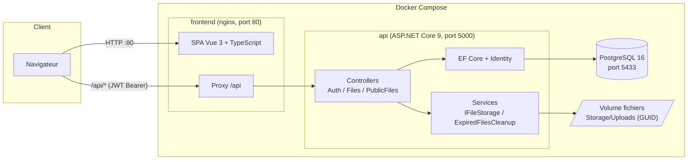
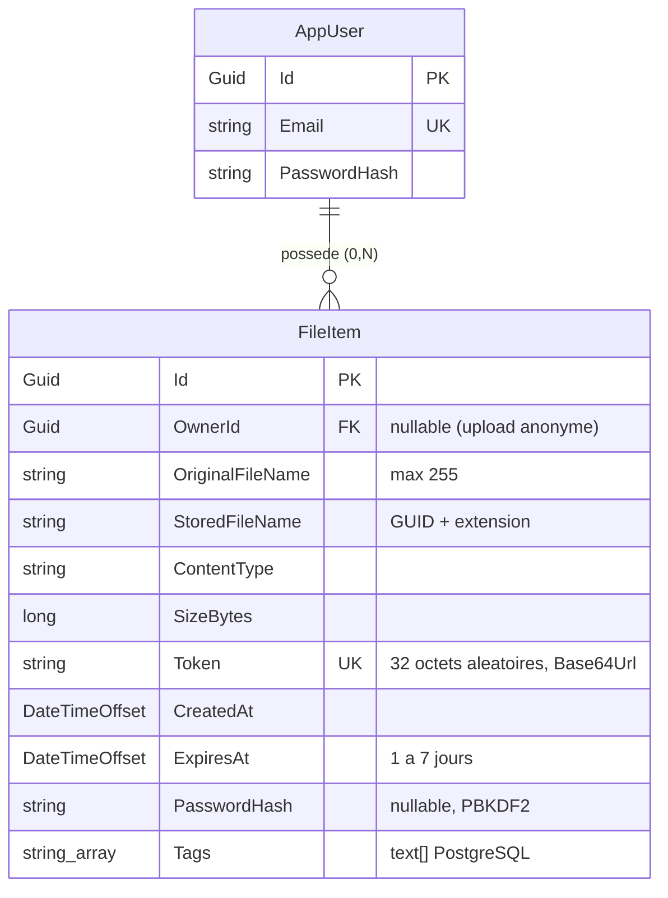
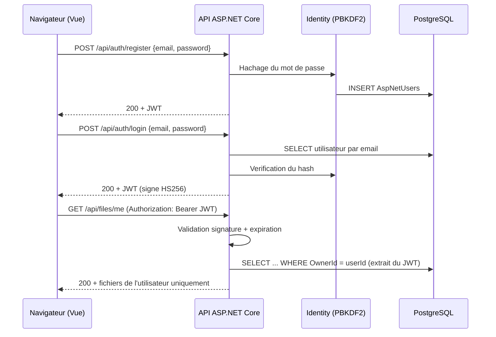
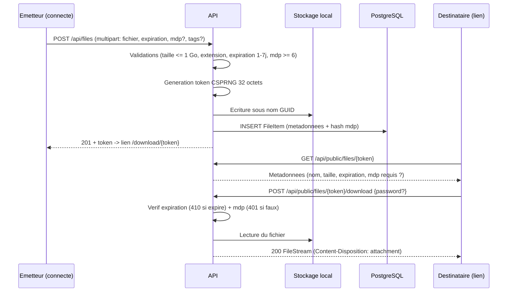

# Diagrammes Mermaid — DataShare

Versions Mermaid des diagrammes du projet (sources draw.io/PlantUML dans `docs/diagrams/`).
Utilisables directement dans Gamma, GitHub, ou exportables en PNG via https://mermaid.live.

## Architecture globale

## Modèle de données (MCD)

## Flux d'authentification (JWT)

## Flux upload et partage

