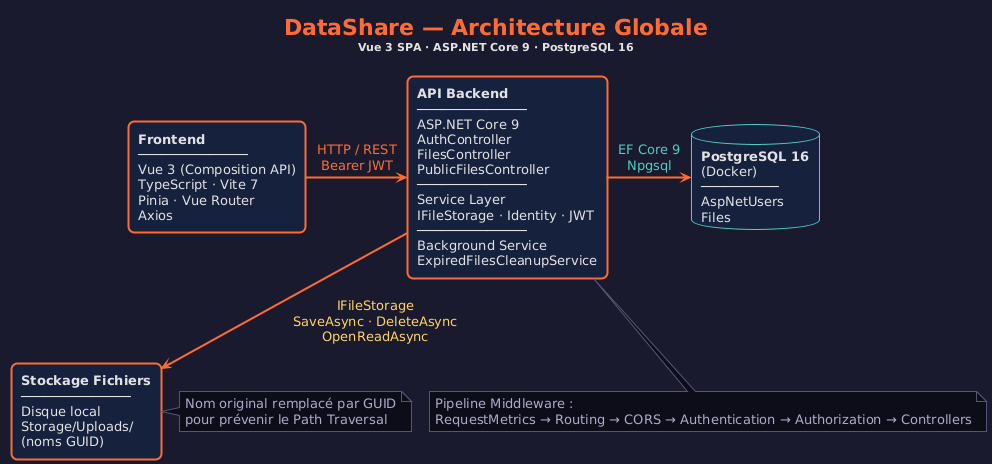
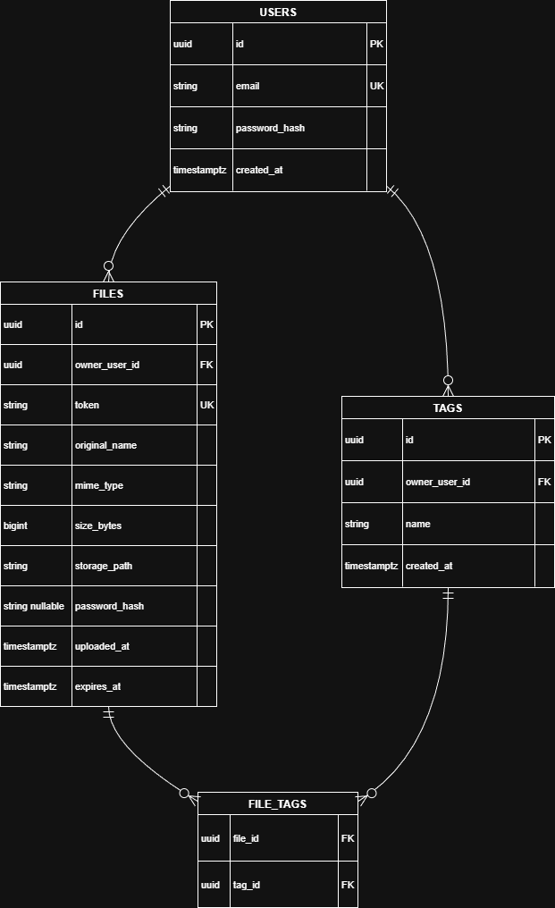
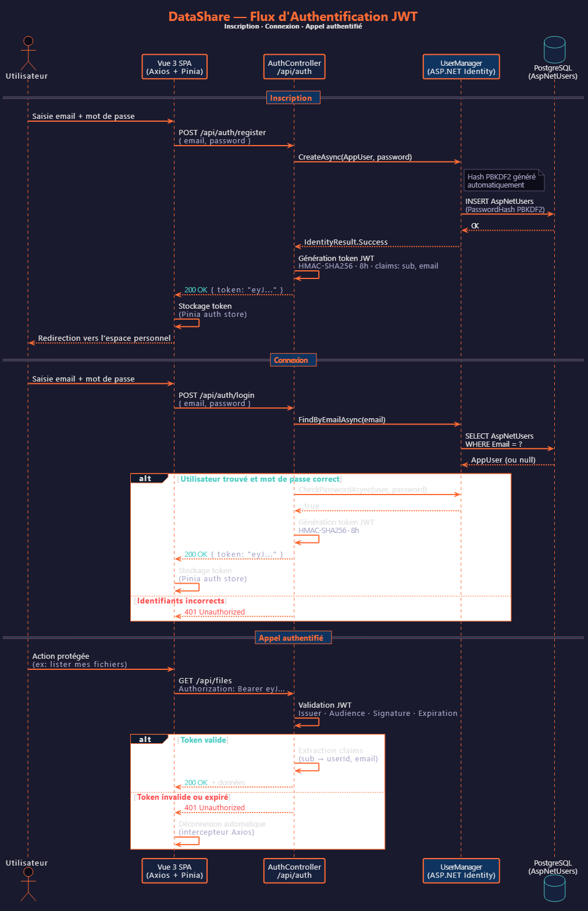

<!-- _class: lead -->

# DataShare

## Plateforme de transfert sécurisé de fichiers

**Soutenance projet 4 — Développeur Architecte Logiciel**

Ethan Legros — Référent technique senior, DataShare

*Visuel : capture de la page d'accueil (http://localhost) en arrière-plan ou en vignette.*

<!-- ~30 s — accueil, se présenter, annoncer le plan -->

---

# Contexte fonctionnel

- **DataShare** : jeune entreprise numérique, cible **freelances et petites entreprises**
- Besoin : transférer des fichiers via des **liens de téléchargement temporaires**
- Mission confiée par la responsable produit : un **MVP en 4 semaines** pour une démo investisseurs
- Rôle : pilotage complet — architecture, développement, qualité, supervision d'un copilote IA
- Exigences : authentification sécurisée, téléversement, liens de partage, **maquettes Figma à respecter**

*Visuel : capture de la page d'accueil (page Upload, http://localhost).*

<!-- ~1 min -->

---

# Périmètre fonctionnel : 10 user stories

| MVP (obligatoire) | Avancées (optionnelles) — **toutes livrées** |
|---|---|
| US01 — Upload avec compte | US07 — Upload anonyme |
| US02 — Téléchargement via lien | US08 — Tags (développée par IA supervisée) |
| US03 — Création de compte | US09 — Protection par mot de passe |
| US04 — Connexion (JWT) | US10 — Expiration automatique (1 à 7 jours) |
| US05 — Historique des fichiers | |
| US06 — Suppression | |

*Visuel : capture de la page « Mon espace » (http://localhost/me) montrant historique, tags, statuts.*

<!-- ~1 min — insister : 100 % du MVP + 100 % des fonctionnalités avancées -->

---

# Choix technologiques

| Couche | Choix (parmi les options imposées) | Alternatives écartées |
|---|---|---|
| Back-end | **ASP.NET Core 9 (C#)** | Spring Boot, NestJS, Symfony |
| Front-end | **Vue 3 + TypeScript + Vite** | Angular, React |
| Base de données | **PostgreSQL 16** | MongoDB |
| Stockage | **Système de fichiers local** | AWS S3 |
| Infra | **Docker Compose** (db + api + front nginx) | — |

*Visuel : logos des technologies, ou ce tableau tel quel.*

<!-- ~1 min -->

---

# Justification des choix

- **ASP.NET Core** : Identity intégré (hachage PBKDF2, gestion utilisateurs **sans code maison**), EF Core (requêtes paramétrées anti-injection), `IHostedService` pour la purge automatique (US10), performances I/O validées par k6
- **Vue 3 + TypeScript** : typage de bout en bout, bundle léger (**~57 Ko gzip**), lazy loading des routes
- **PostgreSQL** : données relationnelles (utilisateur → fichiers), type natif `text[]` pour les tags, transactions ACID
- **Stockage local** : suffisant pour un MVP, isolé derrière une interface `IFileStorage` → **migration S3 possible sans toucher aux contrôleurs**
- **Docker** : environnement reproductible, démo fiable, déploiement en une commande

*Visuel : aucun — slide de discours. Éventuellement le schéma IFileStorage → LocalFileStorage.*

<!-- ~1 min 30 -->

---

# Architecture de la solution

- SPA Vue servie par **nginx**, qui fait aussi **proxy `/api`** vers le backend
- API REST **stateless** (JWT) → scalable horizontalement
- Migrations EF Core appliquées **automatiquement au démarrage**

*Visuel : `docs/diagrams/architecture_globale.drawio.png` (déjà dans le repo).*

<!-- ~1 min 30 -->

---

# Modèle de données

- **AppUser** (ASP.NET Identity, PK `Guid`) —< **FileItem** (relation 0,N ; `OwnerId` **nullable** pour l'upload anonyme)
- `FileItem` : nom original + **nom stocké (GUID)**, taille, type MIME, **token de partage (128)**, expiration, hash du mot de passe, tags `text[]`

*Visuel : `docs/diagrams/mcd.drawio.png`.*

<!-- ~1 min -->

---

# Contrat d'interface — API REST

| Endpoint | Rôle | Accès |
|---|---|---|
| `POST /api/auth/register` · `login` | Compte + JWT | Public |
| `POST /api/files` | Upload (US01) | JWT |
| `GET /api/files/me` | Historique (US05) | JWT |
| `DELETE /api/files/{id}` | Suppression (US06) | JWT + propriétaire |
| `POST /api/public/files` | Upload anonyme (US07) | Public |
| `GET /api/public/files/{token}` | Métadonnées avant téléchargement | Public |
| `POST /api/public/files/{token}/download` | Téléchargement (US02) | Public (+ mdp) |

Documenté en **OpenAPI** (`docs/openapi.yaml`) + **Swagger UI** intégré

*Visuel : capture de Swagger UI (voir liste des captures).*

<!-- ~1 min -->

---

# Sécurité et gestion des accès

- **JWT** signé HS256, validé sur chaque requête ; mots de passe **hachés PBKDF2** (Identity)
- Liens de partage : **token aléatoire 32 octets** (CSPRNG), non prédictible, distinct de l'ID
- Fichiers renommés en **GUID** sur disque → anti path-traversal ; **extensions exécutables interdites** ; limite **1 Go**
- Isolation : chaque requête privée filtre par l'ID utilisateur **extrait du JWT côté serveur**
- Validation **double** : client (UX) + serveur (sécurité)

*Visuel : `docs/diagrams/flux_authentification.drawio.png`.*

<!-- ~1 min 30 -->

---

# Démonstration

**Parcours complet en live :**

1. Création de compte → connexion (JWT)
2. Upload d'un fichier : expiration personnalisée, **mot de passe**, **tags**
3. « Mon espace » : historique, filtre par tag, copie du lien
4. Fenêtre privée : lien public → métadonnées → mot de passe → téléchargement
5. **Gestion d'erreurs** : mauvais mot de passe, fichier `.exe` refusé, lien supprimé → erreur explicite
6. Suppression du fichier → lien invalidé

*Visuel : bascule sur l'application en live (http://localhost). Prévoir un fichier de test et un `.exe` factice sur le bureau.*

<!-- ~4 min — le parcours exact est détaillé dans le script oral -->

---

# Aperçu de la documentation

- **README** : prérequis, lancement Docker en 1 commande ou dev local, structure du projet
- **Documentation technique** (LaTeX/PDF) : architecture, choix justifiés, modèle de données, API, sécurité, installation, IA
- **OpenAPI** : `docs/openapi.yaml` + `API_REFERENCE.md` + Swagger
- **Suivi qualité** en 4 fichiers : `TESTING.md`, `SECURITY.md`, `PERF.md`, `MAINTENANCE.md`
- **Scripts de déploiement** : `scripts/deploy.ps1|.sh`, sauvegarde/restauration BDD
- Historique Git : **conventional commits**, contributions IA isolées

*Visuel : capture du README sur GitHub + capture de `docs/openapi.yaml` ou de l'arborescence `docs/`.*

<!-- ~1 min -->

---

# Qualité en chiffres

| Indicateur | Résultat | Objectif |
|---|---|---|
| Tests backend (xUnit, unitaires + intégration) | **32 / 32 verts** | — |
| Couverture code métier (hors migrations) | **83 % lignes** | ≥ 70 % |
| Tests e2e Cypress | 5 scénarios critiques | ≥ 2-3 |
| k6 — upload, 20 utilisateurs simultanés | **P95 = 125 ms, 0 % erreur** | < 2 s |
| Lighthouse Performance / Best Practices | **96 / 100** | ≥ 90 |
| Vulnérabilités connues (npm + NuGet, 08/2026) | **0** après correctifs documentés | 0 |

*Visuel : `docs/coverage-report.png` (gauche) + `docs/lighthouse-scores.png` (droite).*

<!-- ~1 min 30 — mentionner honnêtement Accessibility 76 et le plan d'action -->

---

# Pilotage du copilote IA — US08 (tags)

- **Tâche assignée** : implémenter tout le frontend des tags (saisie, affichage, filtre) — prompt tracé dans `IA_Instructions.txt`
- **Contraintes imposées** : pas de nouvelle librairie, style existant, normalisation (trim, unicité, longueur max)
- **Supervision** : relecture complète du diff, tests manuels des cas limites
- **Correctifs humains** : messages d'erreur UI absents, validation insuffisante → commits séparés
- Traçabilité Git : `feat` (IA) puis `fix` (revue humaine)
- **Bilan** : ~2 h économisées, mais l'IA néglige l'UX d'erreur et ne propose pas de tests → **la revue humaine reste indispensable**

*Visuel : capture de l'historique Git (commits IA/revue) ou du tableau de corrections dans AI_USAGE.md.*

<!-- ~1 min 30 -->

---

# Bilan et perspectives

**Livré en 4 semaines :**
- 10/10 user stories (MVP + avancées), app conteneurisée, testée, documentée
- Un cas réel de gestion de vulnérabilités traité et documenté (CVE `Microsoft.OpenApi`, audit npm)

**Prochaines itérations :**
- Accessibilité : contrastes hérités de la maquette → **atelier avec l'UX designer**, attributs ARIA
- Rate limiting sur l'authentification, refresh tokens
- Stockage S3 (interface `IFileStorage` prête), scan antivirus des uploads

**Merci — place aux questions.**

*Visuel : aucun, ou reprendre la capture d'accueil.*

<!-- ~1 min — conclure calmement, sourire, inviter aux questions -->
